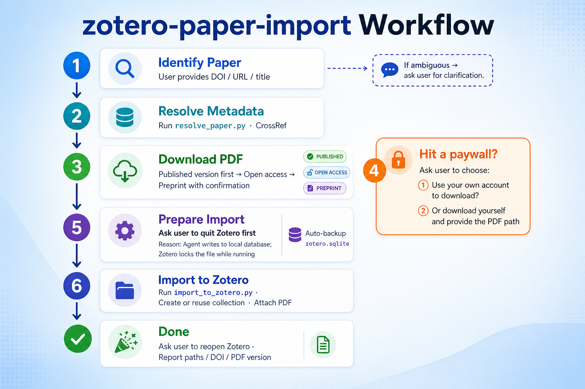

# zotero-paper-import

[English](README.md) | [????](README.zh-CN.md)

A [Cursor Agent Skill](https://cursor.com/docs/agent/skills) that finds academic papers, downloads PDFs, and imports them into your local Zotero library with a named collection.

## What it does

| Step | Action |
|------|--------|
| 1 | Resolve a paper from DOI, URL, title, or query |
| 2 | Download the best available PDF (published version preferred) |
| 3 | Handle paywalls by asking the user |
| 4 | Import metadata + PDF into Zotero |
| 5 | Organize into a user-specified collection |

## Workflow



<details>
<summary>Step-by-step breakdown</summary>

1. **Identify paper** ù User provides DOI, URL, or title. If ambiguous, the agent asks for clarification.
2. **Resolve metadata** ù `resolve_paper.py` fetches data from CrossRef / Semantic Scholar.
3. **Download PDF** ù Published version first, then open access, then preprint (with user confirmation).
4. **Paywall** ù Ask the user: use your own account to download, or download yourself and provide the PDF path.
5. **Prepare import** ù Ask the user to **quit Zotero** (the agent writes to the local database; Zotero locks the file while running). Auto-backup `zotero.sqlite`.
6. **Import to Zotero** ù `import_to_zotero.py` creates or reuses a collection and attaches the PDF.
7. **Done** ù Ask the user to reopen Zotero. Report paths, DOI, and PDF version.

</details>

## Install

### Personal skill (all projects)

```bash
git clone https://github.com/FidollarinLA/zotero-paper-import.git ~/.cursor/skills/zotero-paper-import
```

### Project skill (single repo)

```bash
mkdir -p .cursor/skills
git clone https://github.com/FidollarinLA/zotero-paper-import.git .cursor/skills/zotero-paper-import
```

### Optional configuration

```bash
cp config.example.md config.md
# Edit config.md with your paths and email
```

`config.md` is gitignored and never committed.

## Usage

In Cursor chat:

```
Use zotero-paper-import to import DOI 10.1038/s41586-026-10644-y
into Zotero collection "My Papers"
```

Or run scripts directly:

```bash
python3 scripts/resolve_paper.py --doi 10.1038/s41586-026-10644-y
python3 scripts/download_pdf.py --doi 10.1038/s41586-026-10644-y --output ./paper.pdf
python3 scripts/import_to_zotero.py --doi 10.1038/s41586-026-10644-y --pdf ./paper.pdf --collection "My Papers"
```

## Requirements

- macOS or Linux
- [Zotero](https://www.zotero.org/) installed locally
- `curl` and `python3` (stdlib only)
- Zotero must be **closed** during import

## File structure

```
zotero-paper-import/
??? SKILL.md                 # Agent instructions
??? README.md                # English documentation
??? README.zh-CN.md          # Chinese documentation
??? config.example.md        # User config template
??? examples.md              # Conversation examples
??? reference.md               # PDF sources, Zotero fields
??? LICENSE
??? assets/
?   ??? workflow-en-infographic-v2.png
?   ??? workflow-zh-infographic-v2.png
??? scripts/
    ??? resolve_paper.py
    ??? download_pdf.py
    ??? import_to_zotero.py
```

## Scope

**v1**: journal articles, conference papers, preprints.

**Not yet**: books, book chapters, theses.

## Safety

- Backs up `zotero.sqlite` before every import
- Verifies downloads are real PDFs (not HTML paywall pages)
- Asks before using preprints when a published version was requested
- Never embeds institution-specific proxy URLs

## License

MIT ù see [LICENSE](LICENSE).

## Contributing

Pull requests welcome. Do not commit personal paths, emails, or institution-specific proxy URLs.
