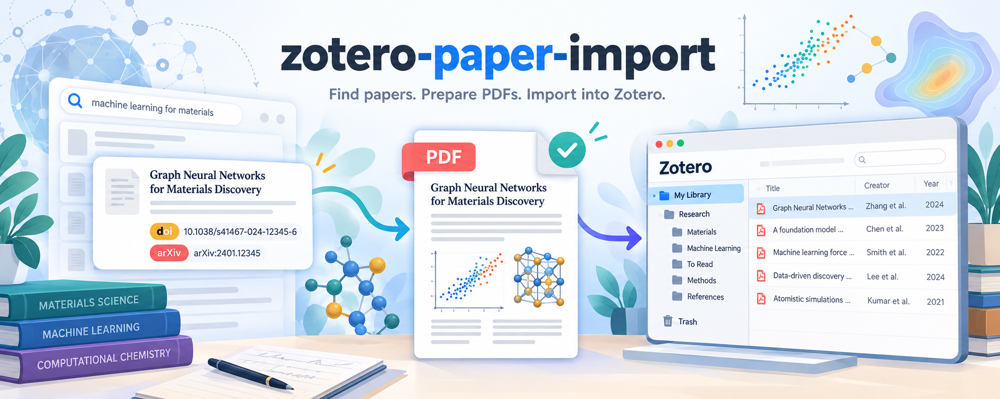
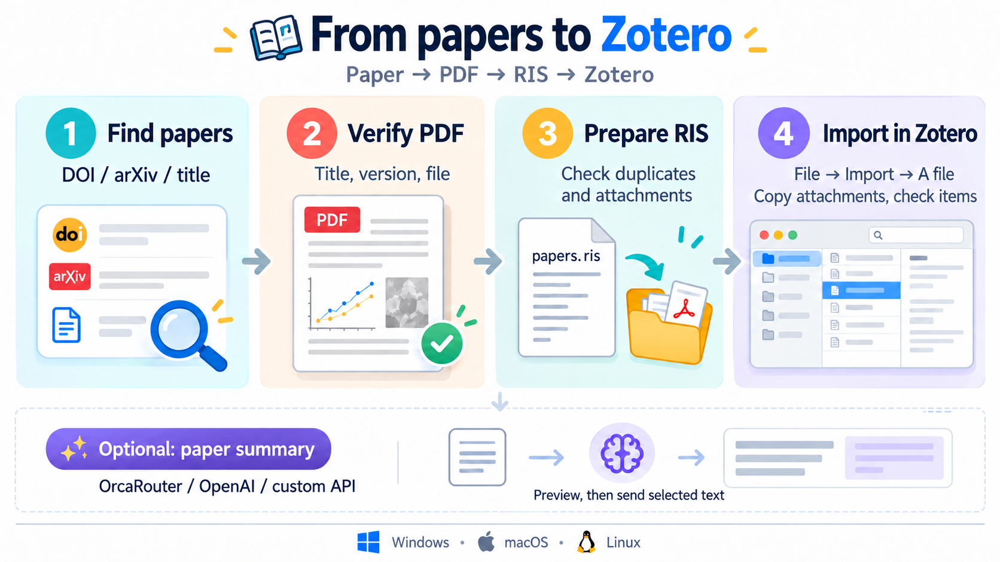

# zotero-paper-import

[English](README.md) · [简体中文](README.zh-CN.md)



Give your agent a DOI, an arXiv link or a paper title. This skill helps it find the paper, check the PDF and prepare a file you can import into Zotero. It runs locally on Windows, macOS and Linux.

The final step uses Zotero's own importer. An agent with desktop controls can help, or you can do it yourself. Check the library items and attachments before calling the import complete.



```text
DOI / arXiv / title
        |
        v
Confirm paper and version --> Get PDF --> Check metadata and duplicates
                                                    |
                                                    v
                                              papers.ris
                                                    |
                                                    v
                                   Zotero: File > Import > A file
                                                    |
                                                    v
                                   Copy attachments and check the library
```

## Start on Windows

You need [Python 3.10 or newer](https://www.python.org/downloads/windows/), [Zotero](https://www.zotero.org/download/) and an agent that supports local skills. The network helpers use `curl.exe`, included in current Windows 10 and Windows 11 installations. Basic import needs no model API key.

1. [Download the repository ZIP](https://github.com/FidollarinLA/zotero-paper-import/archive/refs/heads/main.zip) and extract it.
2. Open PowerShell in the extracted `zotero-paper-import-main` folder.
3. Install for the agent you use:

```powershell
py -3 --version
py -3 .\scripts\install_skill.py --agent cursor
```

Replace `cursor` with `codex` or `claude` for those agents. The installer copies the full skill into the supported user directory, without Git. To refresh an existing copy, add `--update`; your local `config.md` stays in place.

Reload skills or start a new chat. Try:

> Use zotero-paper-import to import https://arxiv.org/abs/1706.03762 into my Zotero collection "To read". Use the preprint PDF, skip duplicates, and tell me what remains to be done.

Codex supports `$zotero-paper-import`; Cursor also supports `/zotero-paper-import`. Run the helpers on the computer that has your PDFs and Zotero data. A remote agent needs access to those files first.

## Check your setup

Run from the repository or installed skill folder:

```powershell
py -3 .\scripts\doctor.py
```

This checks Python, curl, the default Zotero database and the shipped OrcaRouter configuration. It reports whether a key is set, without displaying it. The default database is `~/Zotero/zotero.sqlite`. For a custom data directory:

```powershell
py -3 .\scripts\doctor.py --zotero-db "D:\Research\Zotero\zotero.sqlite"
```

A missing database allows preparation with batch-only duplicate checks. An existing unreadable database needs attention before you continue. Save collection and download preferences in a local `config.md` using [the template](config.example.md).

## Run the import steps

The example uses *Attention Is All You Need*. Check the returned metadata before continuing:

```powershell
py -3 .\scripts\resolve_paper.py --arxiv 1706.03762
py -3 .\scripts\download_pdf.py --arxiv 1706.03762 --preference any --output .\paper.pdf
py -3 .\scripts\import_to_zotero.py --arxiv 1706.03762 --pdf .\paper.pdf --collection "To read" --output .\papers.ris --receipt .\preparation.json
```

In Zotero, choose **File → Import → A file**, open `papers.ris`, and copy attachments. Put the items in your intended collection and check the metadata and opening PDFs. Keep the source PDFs available until Zotero has copied them.

The receipt lists prepared, skipped and failed papers with attachment hashes. `--collection` records your intended destination; select the actual collection in Zotero. If the receipt has `"ris": null`, do not import an older file at the same path.

On macOS/Linux, use `python3 scripts/...` instead of `py -3 .\scripts\...`. With Git, you can clone directly into `~/.cursor/skills/zotero-paper-import`, Codex's `~/.agents/skills/zotero-paper-import`, or `~/.claude/skills/zotero-paper-import`. [Examples](examples.md) cover DOI lookup and batches.

## Optional OrcaRouter summaries

The summary script reads [providers.json](integrations/providers.json), which includes OrcaRouter. OpenAI and custom OpenAI-compatible HTTPS endpoints are also supported.

[Register through the project's referral link](https://www.orcarouter.ai/ref/ref_e92ed6bbb348dc9b078b) if you need an OrcaRouter account, then create your own key. This is the maintainer's referral link: new signups can be attributed to the project under the partner rules. Public directory publication is a separate OrcaRouter review step.

Set a key for this PowerShell session:

```powershell
$orcaKey = Read-Host "OrcaRouter API key" -AsSecureString
$env:ORCA_KEY = [System.Net.NetworkCredential]::new("", $orcaKey).Password
Remove-Variable orcaKey
py -3 .\scripts\doctor.py --check-provider
```

`ORCAROUTER_API_KEY` is also supported. Set one variable, or use the same value for both. The optional check reads `/models`; it sends no paper text and makes no inference request. It does not verify billing or referral earnings.

To test one actual model response, use the following explicit check. It sends a fixed public test string with a 64-token output cap and may incur fees. It sends no paper text. Add `--model MODEL_ID` to choose a model; otherwise it uses `orcarouter/auto`.

```powershell
py -3 .\scripts\doctor.py --check-inference
```

`inference_tested: true` confirms a non-empty model response. Directory publication and referral earnings still need separate confirmation in OrcaRouter.

Save the selected abstract or excerpt as UTF-8 `abstract.txt`, then preview:

```powershell
py -3 .\scripts\summarize_paper.py --provider orcarouter --input .\abstract.txt --output .\summary.md
```

Preview makes no network request and needs no key. The default `orcarouter/auto` model may incur fees. Choose a current model with `--model`, or keep that default. Add `--send` when you want to transmit the selected text and accept usage fees. The script writes a separate summary; it does not upload the PDF or import the summary into Zotero. Check its claims against the paper.

To use OrcaRouter as a Codex CLI model provider too, merge the provider and profile tables from the [optional TOML example](integrations/orcarouter.codex.toml) into your existing configuration. Set `ORCA_KEY`, then choose `codex --profile orcarouter`. Skill installation leaves the host agent's model settings alone.

## What to expect

- Crossref supplies DOI metadata; arXiv supplies versioned preprint metadata. Searches return candidates to confirm. You can provide verified metadata offline in a manifest when a service is unavailable.
- Published-only downloads keep that version requirement. Unpaywall needs your real email via `--email`. For restricted access, supply a PDF obtained through your own access.
- Duplicate checks normalize DOI links and arXiv versions and ignore trashed records. They cover local libraries, so review group-library matches. Identifier-free duplicates and journal/preprint equivalence need manual review. `new_copy` permits an intentional extra copy.
- Zotero may stay open. Helpers read its database and prepare RIS; Zotero performs library changes. The old database-writing importer and `replace` mode have been retired.
- The PDF signature check catches obvious HTML, not every incomplete PDF. Open the file to verify it. Scope: journal articles, conference papers and preprints.

## Development

```powershell
py -3 -m unittest discover -s tests -v
```

CI covers Windows and Linux with Python 3.10 and 3.13. Tests include Unicode paths, file-handle closure, UTF-8/BOM inputs, ZIP installation, RIS preparation and provider requests. Provider responses are simulated; live inference and attribution need an actual account.

[Skill instructions](SKILL.md) · [Examples](examples.md) · [References](reference.md) · [MIT license](LICENSE)
