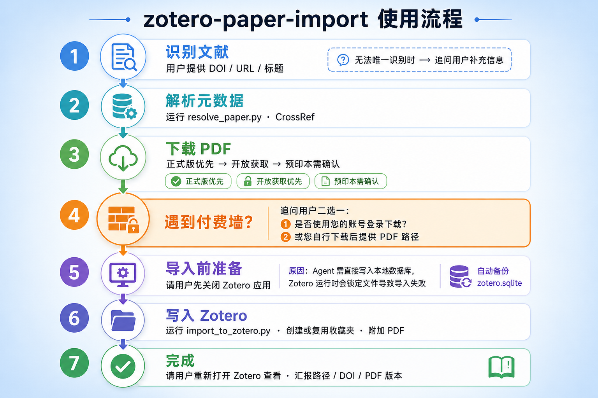

# zotero-paper-import

[English](README.md) | [简体中文](README.zh-CN.md)

一个 [Cursor Agent Skill](https://cursor.com/docs/agent/skills)，用于查找学术论文、下载 PDF，并导入到本地 Zotero 库的指定收藏夹中。

## 功能概览

| 步骤 | 操作 |
|------|------|
| 1 | 通过 DOI、URL、标题或关键词识别文献 |
| 2 | 下载最佳可用 PDF（优先正式发表版） |
| 3 | 遇到付费墙时询问用户 |
| 4 | 将元数据与 PDF 导入 Zotero |
| 5 | 放入用户指定的收藏夹 |

## 使用流程



<details>
<summary>分步说明</summary>

1. **识别文献** - 用户提供 DOI、URL 或标题。若无法唯一识别，Agent 会追问补充信息。
2. **解析元数据** - 运行 `resolve_paper.py`，从 CrossRef / Semantic Scholar 获取数据。
3. **下载 PDF** - 优先正式版，其次开放获取，最后预印本（需用户确认）。
4. **遇到付费墙** - 追问用户二选一：使用您的账号登录下载，或自行下载后提供 PDF 路径。
5. **导入前准备** - 请用户**先关闭 Zotero**（Agent 需写入本地数据库，Zotero 运行时会锁定文件）。同时自动备份 `zotero.sqlite`。
6. **写入 Zotero** - 运行 `import_to_zotero.py`，创建或复用收藏夹，附加 PDF。
7. **完成** - 请用户重新打开 Zotero，汇报路径、DOI 和 PDF 版本。

</details>

## 安装

### 个人 Skill（所有项目可用）

```bash
git clone https://github.com/FidollarinLA/zotero-paper-import.git ~/.cursor/skills/zotero-paper-import
```

### 项目 Skill（仅当前仓库）

```bash
mkdir -p .cursor/skills
git clone https://github.com/FidollarinLA/zotero-paper-import.git .cursor/skills/zotero-paper-import
```

### 可选配置

```bash
cp config.example.md config.md
# 编辑 config.md，填写本地路径和邮箱
```

`config.md` 已加入 `.gitignore`，不会被提交。

## 使用方法

在 Cursor 对话中说：

```
用 zotero-paper-import，把 DOI 10.1038/s41586-026-10644-y 导入 Zotero，收藏夹叫 "My Papers"
```

或直接运行脚本：

```bash
python3 scripts/resolve_paper.py --doi 10.1038/s41586-026-10644-y
python3 scripts/download_pdf.py --doi 10.1038/s41586-026-10644-y --output ./paper.pdf
python3 scripts/import_to_zotero.py --doi 10.1038/s41586-026-10644-y --pdf ./paper.pdf --collection "My Papers"
```

## 环境要求

- macOS 或 Linux
- 本地安装 [Zotero](https://www.zotero.org/)
- `curl` 和 `python3`（仅标准库，无需 pip 安装）
- 导入时 Zotero 必须**已关闭**

## 目录结构

```text
zotero-paper-import/
|-- SKILL.md                 # Agent 主指令
|-- README.md                # 英文文档
|-- README.zh-CN.md          # 中文文档
|-- config.example.md        # 配置模板
|-- examples.md              # 对话示例
|-- reference.md             # PDF 来源与 Zotero 字段
|-- LICENSE
|-- assets/
|   |-- workflow-en-infographic-v2.png
|   |-- workflow-zh-infographic-v2.png
|-- scripts/
    |-- resolve_paper.py
    |-- download_pdf.py
    |-- import_to_zotero.py
```

## 支持范围

**v1 支持**：期刊论文、会议论文、预印本。

**暂不支持**：书籍、书籍章节、学位论文。

## 安全机制

- 每次导入前自动备份 `zotero.sqlite`
- 校验下载文件为真实 PDF（而非 HTML 付费墙页面）
- 用户要求正式版时，不会静默降级为预印本
- 不嵌入任何机构专属代理 URL

## 许可证

MIT - 见 [LICENSE](LICENSE)。

## 贡献

欢迎 Pull Request。请勿提交个人路径、邮箱或机构代理配置。
