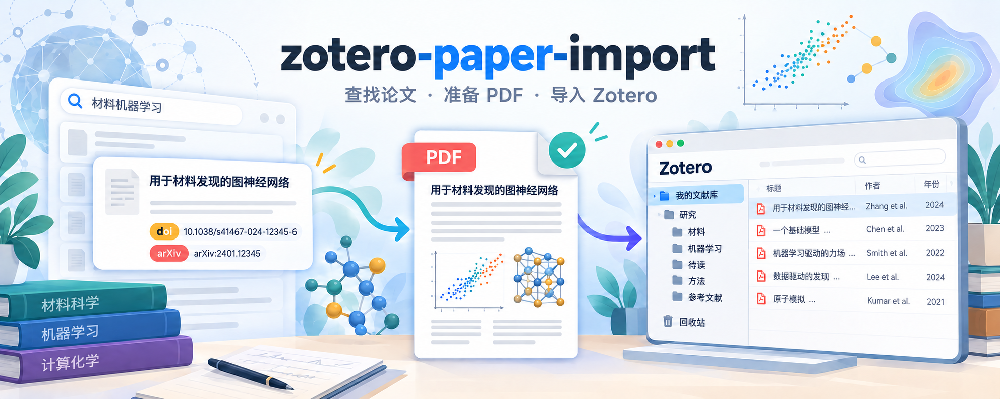
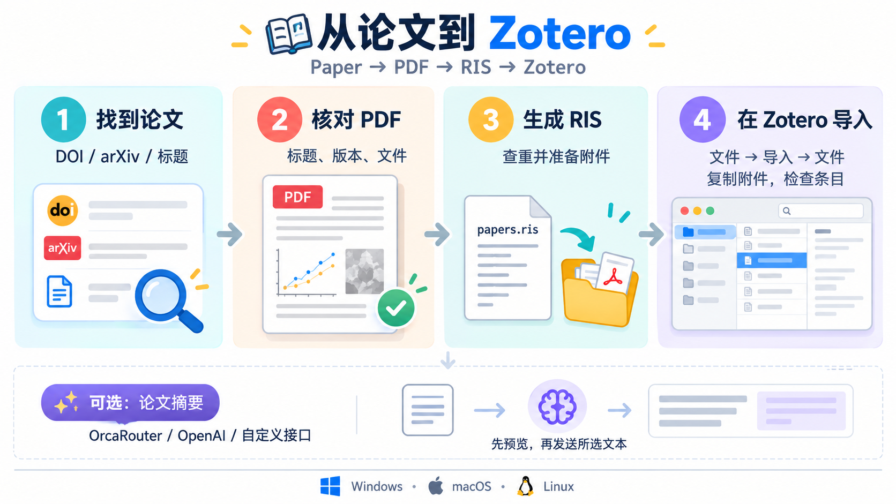

# zotero-paper-import

[English](README.md) · [简体中文](README.zh-CN.md)



把 DOI、arXiv 链接或论文标题交给 Agent，这个 skill 会帮助它查找论文、核对 PDF，并准备 Zotero 导入文件。脚本在本地运行，支持 Windows、macOS 和 Linux。

最后一步使用 Zotero 自带的导入功能。有桌面操作工具的 Agent 可以协助完成，你也可以自己操作。导入后检查文献条目和附件，才算完成。



```text
DOI / arXiv / 论文标题
          |
          v
确认论文与版本 --> 取得 PDF --> 核对元数据、查重
                                     |
                                     v
                               生成 papers.ris
                                     |
                                     v
                         Zotero：文件 > 导入 > 文件
                                     |
                                     v
                         复制附件，检查条目和分类
```

## Windows 上开始使用

先安装 [Python 3.10 或更新版本](https://www.python.org/downloads/windows/) 和 [Zotero](https://www.zotero.org/download/)，准备一个支持本地 skill 的 Agent。联网脚本还需要 `curl.exe`，当前 Windows 10、Windows 11 通常已自带。基础论文导入不需要模型 API Key。

1. [下载仓库 ZIP](https://github.com/FidollarinLA/zotero-paper-import/archive/refs/heads/main.zip)，解压。
2. 在解压后的 `zotero-paper-import-main` 文件夹里打开 PowerShell。
3. 按你使用的 Agent 安装：

```powershell
py -3 --version
py -3 .\scripts\install_skill.py --agent cursor
```

使用 Codex 就把 `cursor` 换成 `codex`；使用 Claude Code 就换成 `claude`。安装器会复制到对应的用户技能目录，不需要 Git。以后更新，在命令末尾加 `--update`，已有的本地 `config.md` 会保留。

重新加载技能，或开一个新对话。可以直接这样说：

> 使用 zotero-paper-import，把 https://arxiv.org/abs/1706.03762 导入我的 Zotero「待读」分类。使用预印本 PDF，跳过重复论文，并告诉我还有哪些步骤需要完成。

Codex 可以用 `$zotero-paper-import` 选择技能，Cursor 可以用 `/zotero-paper-import`。让脚本运行在存有 PDF 和 Zotero 数据的电脑上；远程 Agent 使用前需要先解决文件访问问题。

## 检查环境

在解压目录或安装后的技能目录运行：

```powershell
py -3 .\scripts\doctor.py
```

它检查 Python、curl、默认 Zotero 数据库和项目提供的 OrcaRouter 配置。密钥检查只显示是否设置，不显示密钥内容。数据库默认位于 `~/Zotero/zotero.sqlite`。如果你改过 Zotero 数据目录，指定实际位置：

```powershell
py -3 .\scripts\doctor.py --zotero-db "D:\Research\Zotero\zotero.sqlite"
```

找不到数据库时，可以准备导入文件，但只检查本批次内部的重复记录。已有数据库读不了时，先处理路径或读取问题。分类、下载位置和版本偏好可以保存在本地 `config.md`，见[配置模板](config.example.md)。

## 手动跑一遍

下面用 *Attention Is All You Need* 的 arXiv 编号演示。先看第一条命令返回的元数据，确认论文，再继续：

```powershell
py -3 .\scripts\resolve_paper.py --arxiv 1706.03762
py -3 .\scripts\download_pdf.py --arxiv 1706.03762 --preference any --output .\paper.pdf
py -3 .\scripts\import_to_zotero.py --arxiv 1706.03762 --pdf .\paper.pdf --collection "待读" --output .\papers.ris --receipt .\preparation.json
```

在 Zotero 选择 **文件 → 导入 → 文件**，打开 `papers.ris`，选择复制附件。把导入的条目放入目标分类，再核对标题、作者、编号和 PDF 能否打开。Zotero 复制完成前，保留原 PDF。

`preparation.json` 逐篇记录 prepared、skipped 或 failed，并保存 PDF 哈希。`--collection` 记录目标，实际分类仍在 Zotero 中选择。如果结果是 `"ris": null`，本批没有新的导入文件，不要重新导入该路径上保留的旧文件。

macOS、Linux 把 `py -3 .\scripts\...` 换成 `python3 scripts/...`。有 Git 时，可直接克隆到 `~/.cursor/skills/zotero-paper-import`、Codex 的 `~/.agents/skills/zotero-paper-import`，或 Claude Code 的 `~/.claude/skills/zotero-paper-import`。[更多示例](examples.md)包含 DOI 和批量清单。

## 可选：使用 OrcaRouter 生成摘要

项目已在 [providers.json](integrations/providers.json) 中提供 OrcaRouter 配置，摘要脚本会读取它。也可选择 OpenAI，或自定义的 OpenAI 兼容 HTTPS 接口。

需要账号时，通过[项目推荐链接](https://www.orcarouter.ai/ref/ref_e92ed6bbb348dc9b078b)注册并创建自己的 API Key。这个链接属于项目作者，新注册的账号可按平台规则计入项目分成。公开目录的审核、发布由 OrcaRouter 单独处理。

在当前 PowerShell 会话中设置密钥：

```powershell
$orcaKey = Read-Host "OrcaRouter API key" -AsSecureString
$env:ORCA_KEY = [System.Net.NetworkCredential]::new("", $orcaKey).Password
Remove-Variable orcaKey
py -3 .\scripts\doctor.py --check-provider
```

也支持 `ORCAROUTER_API_KEY`。设置其中一个即可；两个都设置时，值应一致。`--check-provider` 只读取模型列表，不发送论文文本，也不执行模型推理。它不能证明计费或推荐收益已经产生。

需要验证一次真实模型回复时，运行下面的显式检查。它只发送固定的公开测试句，输出上限为 64 token，可能产生费用，不发送论文文本。默认使用 `orcarouter/auto`；可加 `--model 模型编号` 指定模型。

```powershell
py -3 .\scripts\doctor.py --check-inference
```

结果中的 `inference_tested: true` 表示收到非空模型回复。目录收录和推荐收益仍需在 OrcaRouter 中分别确认。

把需要摘要的原文段落保存为 UTF-8 `abstract.txt`，先预览：

```powershell
py -3 .\scripts\summarize_paper.py --provider orcarouter --input .\abstract.txt --output .\summary.md
```

预览不联网，也不需要密钥。默认 `orcarouter/auto` 可能产生费用；可用 `--model` 指定当前列表中的模型。确认要发送这段文本并接受使用费用后，在命令末尾加 `--send`。程序只发送所选文本，生成单独的摘要文件。PDF 和摘要不会因此自动导入 Zotero，生成内容需要对照原文检查。

如果还想让 Codex CLI 本身通过 OrcaRouter 调用模型，可把[可选 TOML 配置](integrations/orcarouter.codex.toml)中的 provider 和 profile 两段合并到原有配置，设置 `ORCA_KEY`，再运行 `codex --profile orcarouter`。安装本 skill 不会改动宿主 Agent 的模型设置。

## 使用边界

- DOI 元数据来自 Crossref，arXiv 使用其独立 API。标题或主题检索返回候选论文，需要确认。服务不可用时，可通过清单提供已核验的元数据。
- 默认下载正式发表版。Unpaywall 查询需要 `--email` 提供真实联系邮箱。出版社要求个人或机构访问权限时，使用你通过该权限获得的 PDF。
- 查重归一化 DOI 链接和 arXiv 版本，忽略回收站条目，检查本地各文献库。群组库匹配需核对是否还需要个人库副本。无编号的重复记录、正式版和预印本的对应关系需要人工判断。需要另一份副本时，用 `--duplicate-policy new_copy`。
- Zotero 可以保持打开。脚本只读数据库进行查重、生成 RIS，文献库变更由 Zotero 完成。旧版直接写库和 `replace` 模式已经停止使用。
- PDF 签名检查能排除明显的 HTML，仍需打开确认文件完整、论文正确。当前支持期刊、会议论文和预印本。

## 开发与验证

```powershell
py -3 -m unittest discover -s tests -v
```

CI 覆盖 Windows、Linux，使用 Python 3.10 和 3.13。测试包含中文路径、文件句柄、UTF-8/BOM 输入、ZIP 安装、RIS 准备和 provider 请求处理。接口响应是模拟的；真实模型调用和分成归因需要实际账号单独验证。

[Skill 指引](SKILL.md) · [示例](examples.md) · [参考](reference.md) · [MIT 协议](LICENSE)
